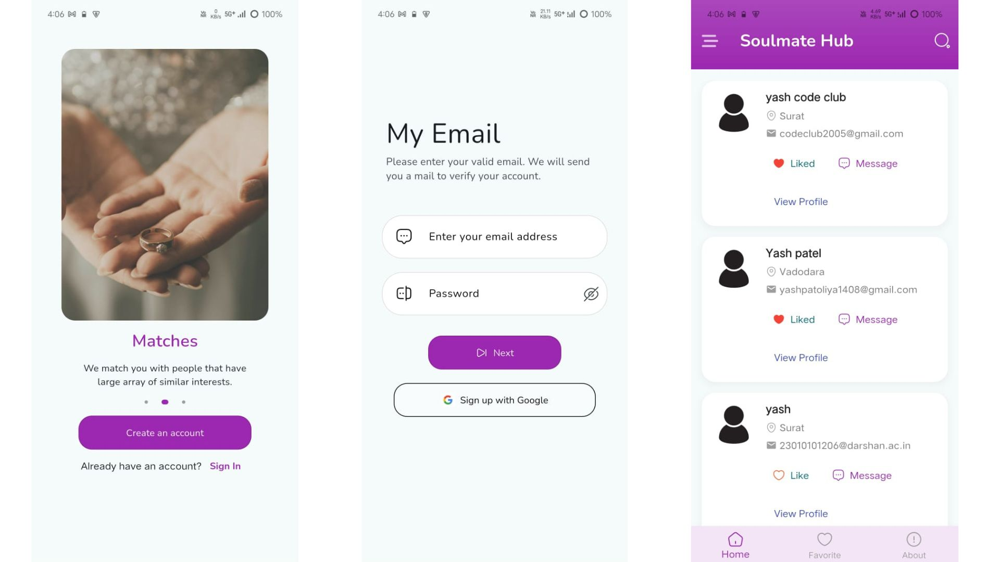
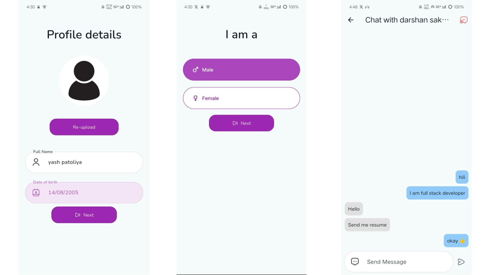

# 💑 Soulmate Hub - Matrimony Flutter App

**Soulmate Hub** is a full-featured matrimony app built with Flutter. It offers a smooth and intuitive user experience to find your perfect life partner. Built using Firebase, Cloudinary, and GetX, the app guides users through a step-by-step profile creation process and provides real-time chat, search, and match features.

---

## ✨ Features

- 🔐 Firebase Authentication with Email & Google Sign-In
- 👣 Step-by-step guided user onboarding (name, DOB, hobbies, gender, etc.)
- 📸 Profile photo upload using **Cloudinary**
- ☁️ User data storage with **Firestore**
- 🧑 View user profiles and profile pictures
- 🔍 Efficient search functionality
- ❤️ Add/remove users to your **Favorites** list
- 💬 Real-time chat messaging using **Firebase Realtime Database**
- 🎯 Smooth navigation using **GetX**
- 🪄 Clean UI with animations and modern design

---

## 🔧 Tech Stack

- **Flutter 3.0+**
- **Dart**
- **Firebase Authentication**
- **Firebase Firestore**
- **Firebase Realtime Database** (for chats)
- **Cloudinary** (for profile image hosting)
- **GetX** (state management and routing)
- **Shared Preferences** (local storage)
- **Google Fonts**

---

## 📱 App Screenshots

### 🔹 Screens

## 🙌 Contribution

Want to improve this app? Contributions are welcome!

- Fork the repo

- Create a feature branch

- Submit a pull request

## 📧 Contact
Created with ❤️ by yash patoliya

##📧 yashpatoliya14@gmail.com
